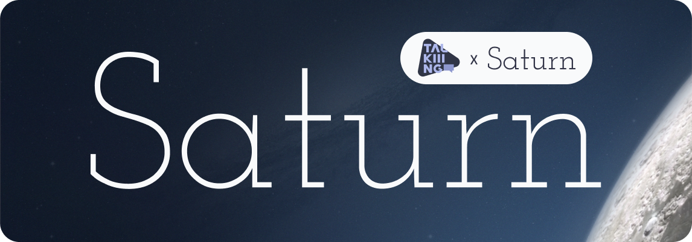

# Начало работы с Saturn 🪐

Полная документация доступна по адресу: [https://saturn.talkiiing.ru](https://saturn.talkiiing.ru)

> [!TIP]
> Демо решения со Swagger документацией можно просмотреть по адресу
> [https://saturn-app.talkiiing.ru/docs](https://saturn-app.talkiiing.ru/docs).

## Установка

Чтобы начать работу скачайте официальный Docker Compose файл:

```bash
curl -o- https://saturn.talkiiing.ru/docker-compose.yml
```

## Настройка

Затем настройте переменные окружения и порты внутри,
**если это необходимо**

### Настройка compose-файла
 
```yml
services:
  chroma:
    ...
    ports:
      - '8000:8000' # Проброс портов ChromaDB `Внешний:Внутренний`

  redis: 
    ...
    ports:
      - '6379:6379' # Проброс портов Redis `Внешний:Внутренний`

  api:
    ...
    ports:
      - '3000:80' # Проброс портов самого API `Внешний:Внутренний`

    # Также во всех сервисах обновите порты до Redis
    environment:
      REDIS_DSN: "redis://redis:6379" # redis://redis:PORT - порт сверху

  worker: ...
    ...
    deploy:
      replicas: 3 # Задайте необходимое количество реплик воркера
```
  


***Но вы также можете использовать этот compose-файл 
без дополнительной настройки***

## Использование

> [!TIP]
> Вы всегда можете просто импортировать наш [OpenAPI v3](https://saturn-app.talkiiing.ru/openapi.json)
в, например, [🏃‍♂️&nbsp;Postman](https://www.postman.com/) 
или [🔮&nbsp;Insomnia](https://insomnia.rest/download)

### Поднять сервис

После скачивания компоуз файла

```bash
curl -o- https://saturn.talkiiing.ru/docker-compose.yml
```

и его настройки, запустите 

```bash
docker compose up 
```

или

```bash
docker compose up -d # для запуска в фоновом режиме
```


